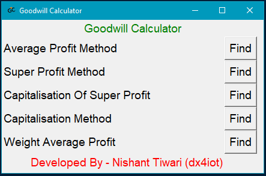
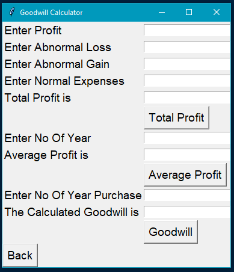
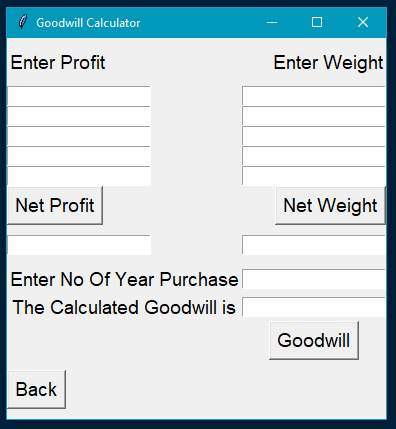
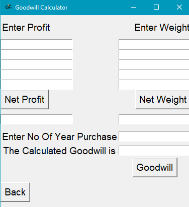
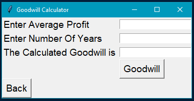

# Goodwill-Calculator

Goodwill Calculator is a program which is used to find goodwill, there are basically five types of method under this goodwill calculator which are: 

#### • Average Profit Method
#### • Super Profit Method
#### • Capitalisation Of Super Profit
#### • Capitalisation Method
#### • Weight Average Profit

## Downloads

• Open the exe folder and download the rar file 

• Extract it and run directly

• You can also download it from SOURCEFORGE (https://sourceforge.net/projects/goodwill-calculator/)

## Screenshots

## Contact Me

  Mail: dx4iot@protonmail.com

  Instagram: https://www.instagram.com/dx4iot.py/

  LinkedIn: https://www.linkedin.com/in/dx4iot

  Facebook: https://www.facebook.com/dx4iot/

