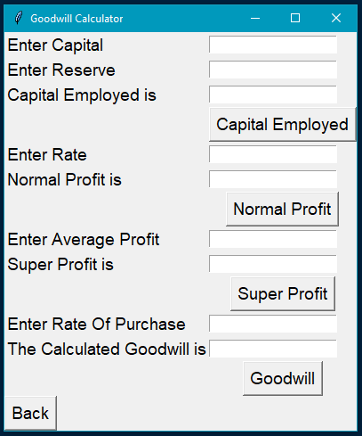

# Goodwill-Calculator
Goodwill Calculator is a program which is used to find goodwill, there are basically five types of method under this goodwill calculator which are: 

#### • Average Profit Method
#### • Super Profit Method
#### • Capitalisation Of Super Profit
#### • Capitalisation Method
#### • Weight Average Profit

## Screenshots

